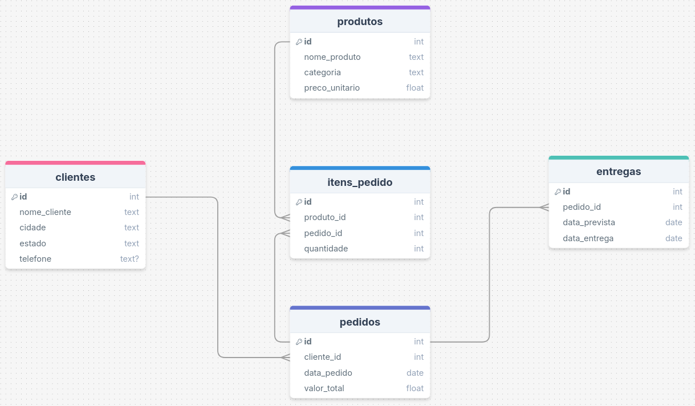

# 🚚 Distribuidora Automatizada

## 💾 Banco de Dados



### 📒 Consultas

#### 🔎 Top 5 produtos mais vendidos no mês

```sql
SELECT pr.nome_produto, SUM(i.quantidade) AS total_vendido
  FROM produtos pr
  JOIN itens_pedido i ON pr.id=i.produto_id
  JOIN pedidos pe ON i.pedido_id=pe.id
  WHERE strftime('%m', pe.data_pedido) = strftime('%m', date())
  GROUP BY pr.nome_produto
ORDER BY total_vendido DESC, pr.nome_produto ASC LIMIT(5);
```

#### 🔎 Clientes que mais compraram

```sql
SELECT c.nome_cliente, SUM(pe.valor_total) AS total_gasto
    FROM clientes c
    JOIN pedidos pe ON pe.cliente_id = c.id
    GROUP BY c.nome_cliente
ORDER BY total_gasto DESC, c.nome_cliente ASC;
```

#### 🔎 Entregas Atrasadas

```sql
SELECT e.id, c.nome_cliente, e.data_prevista, e.data_entrega
    FROM entregas e
    JOIN pedidos pe ON pe.id = e.pedido_id
    JOIN clientes c ON c.id = pe.cliente_id
    WHERE data_entrega > data_prevista
ORDER BY data_entrega DESC;

```

#### 🔎 Faturamento por Estado

```sql
SELECT c.estado, SUM(pe.valor_total) AS faturamento
    FROM clientes c
    JOIN pedidos pe ON c.id=pe.cliente_id
    GROUP BY c.estado
ORDER BY faturamento DESC;
```

## 💿 Como rodar na sua máquina (Linux)

### 📝 Pré-requisitos:

- [Git](https://git-scm.com/downloads)
- [Python 3.9 ou maior](https://www.python.org/downloads/)

```bash

# Clonando o projeto e entrando na pasta
$ git clone https://github.com/lleonardus/distribuidora-automatizada.git
$ cd distribuidora-automatizada

# Configurando virtual environment e instalando as dependências
$ python3 -m venv .venv
$ source .venv/bin/activate
$ python3 -m pip install -r requirements.txt

# Criando as tabelas e inserindo dados fictícios
$ python3 create_tables.py
$ python3 insert_data.py

# Gerando relatório
$ python3 generate_report.py
```

## 🧰 Ferramentas Utilizadas

- [Git](https://git-scm.com/downloads)
- [pandas](https://pandas.pydata.org/docs/getting_started/install.html)
- [Python](https://www.python.org/downloads/)
- [sqlite3](https://docs.python.org/3/library/sqlite3.html#module-sqlite3)
- [Faker](https://pypi.org/project/Faker/)
