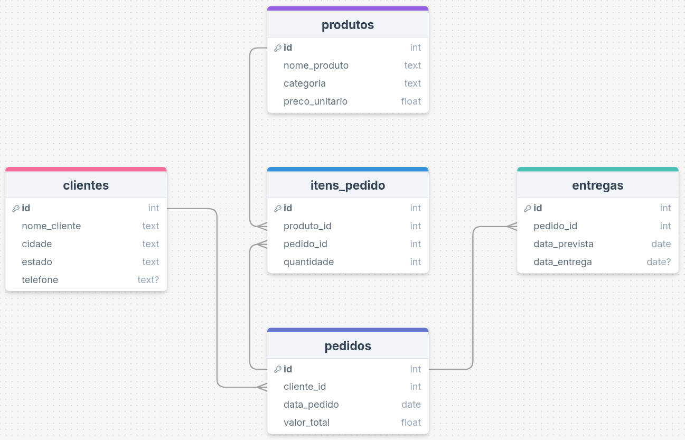

# 🚚 Distribuidora Automatizada

Empresas que atuam no ramo da logística geram grandes volumes de dados diariamente
e precisam analisá-los para tomar as melhores decisões mercadológicas. O problema
é que não dá para simplesmente inserir todo esse volume de dados no Excel, pois
isso poderia causar travamentos e até possíveis perdas de informações.

Pensando nisso, desenvolvi este projeto para simular o fluxo de compras de clientes
em uma distribuidora e realizar consultas em SQL, gerando um relatório contendo
apenas informações relevantes para posterior análise de dados.


## 💾 Banco de Dados



### 📒 Consultas

#### 🔎 Top 5 produtos mais vendidos no mês

```sql
SELECT
    p.nome_produto AS "Produto",
    SUM(i.quantidade) AS "Total Vendido"
FROM produtos p
JOIN itens_pedido i ON i.produto_id = p.id
JOIN pedidos pe ON pe.id = i.pedido_id
WHERE strftime('%Y', pe.data_pedido) = strftime('%Y', 'now')
  AND strftime('%m', pe.data_pedido) = strftime('%m', 'now')
GROUP BY p.nome_produto
ORDER BY SUM(i.quantidade) DESC, p.nome_produto ASC
LIMIT 5;
```

#### 🔎 Clientes que mais compraram

```sql
SELECT
    c.nome_cliente AS "Cliente",
    ROUND(SUM(pe.valor_total), 2) AS "Total Gasto"
FROM clientes c
JOIN pedidos pe ON pe.cliente_id = c.id
GROUP BY c.nome_cliente
ORDER BY SUM(pe.valor_total) DESC, c.nome_cliente ASC;
```

#### 🔎 Entregas Atrasadas

```sql
SELECT
    e.id AS "Entrega Id",
    c.nome_cliente AS "Cliente",
    e.data_prevista AS "Data Prevista",
    e.data_entrega AS "Data de Entrega",
    ROUND(julianday(e.data_entrega) - julianday(e.data_prevista)) AS "Atraso em Dias"
FROM entregas e
JOIN pedidos pe ON pe.id = e.pedido_id
JOIN clientes c ON c.id = pe.cliente_id
WHERE e.data_entrega > e.data_prevista
ORDER BY pe.data_pedido DESC,
         (julianday(e.data_entrega) - julianday(e.data_prevista)) DESC,
         c.nome_cliente ASC;
```

#### 🔎 Faturamento por Estado

```sql
SELECT
    strftime('%Y', pe.data_pedido) AS "Ano",
    c.estado AS "Estado",
    ROUND(SUM(pe.valor_total), 2) AS "Faturamento"
FROM clientes c
JOIN pedidos pe ON pe.cliente_id = c.id
GROUP BY c.estado, strftime('%Y', pe.data_pedido)
ORDER BY strftime('%Y', pe.data_pedido),
         SUM(pe.valor_total) DESC,
         c.estado ASC;
```

#### 🔎 Histórico de Vendas

```sql
SELECT
    strftime('%Y', e.data_entrega) AS "Ano",
    CASE strftime('%m', e.data_entrega)
        WHEN '01' THEN 'Janeiro'
        WHEN '02' THEN 'Fevereiro'
        WHEN '03' THEN 'Março'
        WHEN '04' THEN 'Abril'
        WHEN '05' THEN 'Maio'
        WHEN '06' THEN 'Junho'
        WHEN '07' THEN 'Julho'
        WHEN '08' THEN 'Agosto'
        WHEN '09' THEN 'Setembro'
        WHEN '10' THEN 'Outubro'
        WHEN '11' THEN 'Novembro'
        WHEN '12' THEN 'Dezembro'
        ELSE 'Desconhecido'
    END AS "Mês",
    p.nome_produto AS "Produto",
    ROUND(SUM(i.quantidade * p.preco_unitario), 2) AS "Faturamento"
FROM entregas e
JOIN pedidos pe ON pe.id = e.pedido_id
JOIN itens_pedido i ON i.pedido_id = pe.id
JOIN produtos p ON p.id = i.produto_id
GROUP BY strftime('%Y', e.data_entrega), strftime('%m', e.data_entrega), p.nome_produto
ORDER BY strftime('%Y', e.data_entrega),
         strftime('%m', e.data_entrega),
         p.nome_produto;
```

## 💿 Como rodar na sua máquina (Linux)

### 📝 Pré-requisitos:

- [Git](https://git-scm.com/downloads)
- [Python 3.9 ou maior](https://www.python.org/downloads/)

```bash

# Clonando o projeto e entrando na pasta
$ git clone https://github.com/lleonardus/distribuidora-automatizada.git
$ cd distribuidora-automatizada

# Configurando virtual environment e instalando as dependências
$ python3 -m venv .venv
$ source .venv/bin/activate
$ python3 -m pip install -r requirements.txt

# Definindo as variáveis de ambiente DATABASE e REPORT_PATH.
# Se quiser usar um banco diferente do sqlite, mude a variável DATABASE.
# REPORT_PATH é o local onde será gerado o relatório. Com o valor abaixo,
# ele será gerado na raiz do projeto com o nome de relatorio.xlsx
$ echo -e 'DATABASE=sqlite:///distribuidora.db\nREPORT_PATH=relatorio.xlsx' > .env

# Criando as tabelas e inserindo dados fictícios.
# Se as tabelas já existirem e estiverem com dados, não precisa seguir esse passo
$ python3 -m db.init_db
$ python3 -m db.insert_data

# Gerando relatório
$ python3 main.py
```

## 🧰 Ferramentas Utilizadas

- [Git](https://git-scm.com/downloads)
- [pandas](https://pandas.pydata.org/docs/getting_started/install.html)
- [Python](https://www.python.org/downloads/)
- [SQLAlchemy](https://docs.sqlalchemy.org/en/20/intro.html#installation)
- [python-dotenv](https://pypi.org/project/python-dotenv/)
- [Faker](https://pypi.org/project/Faker/)
